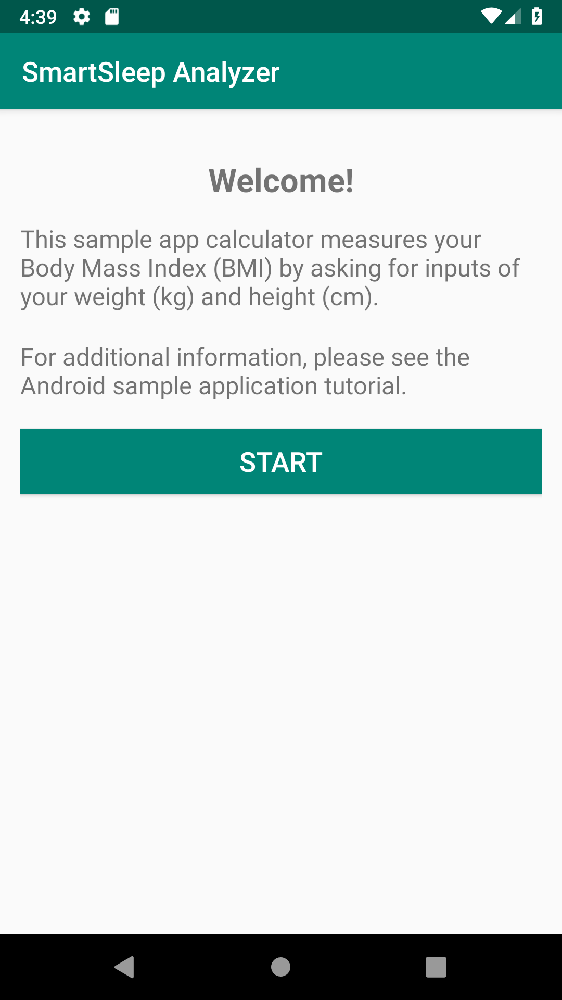

# SmartSleep Analyzer Sample App -- Android

## Introduction

**Description**:  this sample application exemplifies basic usage of the SmartSleep Analyzer API. The API Program documentation offers a tutorial which walks through creation of this app from scratch.

## Requirements

> This sample application assumes the following:
>* Gradle 3.3.2
>* Min SDK Version 14
>* Target SDK Version 28 (Build Tools 28.0.3)

## Getting Started

The application in this repository should be automatically importable, compilable, and runnable.

1.  Clone this repository onto your computer:  `git clone https://github.com/philips-software/SmartSleep-Analyzer-SampleApp-Android.git`
2.  Open *Android Studio*
3.  Either press "Open an Existing Android Studio Project" or click `File > Open...`
4.  Select the `SmartSleep-Analyzer-SampleApp-Android` root folder.
5.  Wait for the Gradle execution to complete.
    * You should see "app" appear as one of the build configurations.
6.  Run the application, choosing either a connected device, or a simulator to run on.
7.  When the application loads, you will see the homescreen of the application.

	The following should appear, once you are up and running:  
	 

## Development

Please refer to our [Contribution Guide](CONTRIBUTING.md) for instructions on how to setup the development environment.

## License

Please refer to our [License](LICENSE.md) file.

## Credits and references

Please see our [Maintainers](MAINTAINERS.md).
